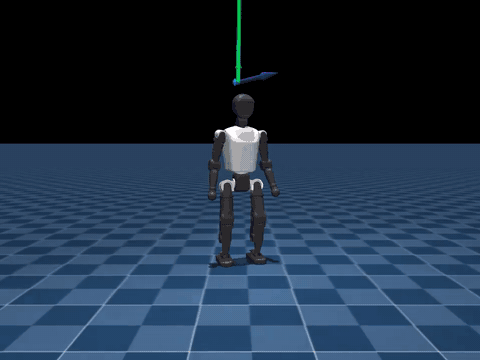
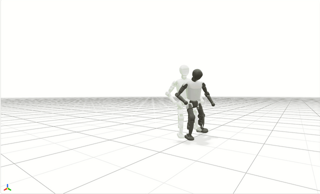
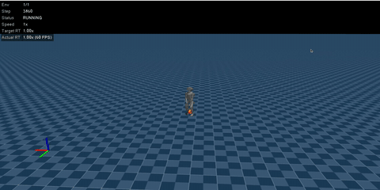
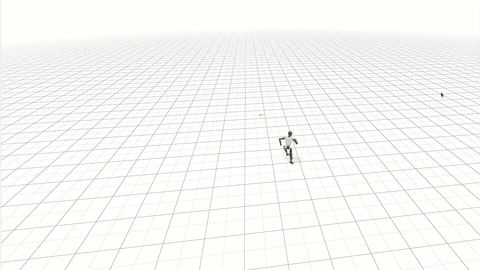

[English](README.md) | **中文**

# Booster MJLab — 人形机器人运动控制与动作跟踪

[](LICENSE)
[](pyproject.toml)
[](pyproject.toml)
[](https://github.com/66Leslie/booster-mjlab/actions/workflows/ci.yml)
[](https://github.com/mujocolab/mjlab_playground)

面向 **Booster T1** 与 **Booster K1** 人形机器人的强化学习环境，覆盖速度控制、参考动作跟踪，以及基于对抗式运动先验（AMP）的目标点运动。

基于 [mujocolab/mjlab_playground](https://github.com/mujocolab/mjlab_playground) 的 [`b036472`](https://github.com/mujocolab/mjlab_playground/commit/b036472) 版本开发 —— 完整差异见[相对上游新增了什么](#相对上游新增了什么)。

## 目录

- [演示](#演示)
- [相对上游新增了什么](#相对上游新增了什么)
- [环境列表](#环境列表)
- [安装](#安装)
- [训练与评估](#训练与评估)
- [动作数据](#动作数据)
- [项目结构](#项目结构)
- [文档](#文档)
- [权重](#权重)
- [致谢](#致谢)
- [引用](#引用)
- [许可证](#许可证)

## 演示

**Booster T1 · 速度控制** —— 在平地上跟踪平面速度指令。



**Booster T1 · 参考动作跟踪** —— 跟踪一段参考动作。



**Booster K1 · 基于 AMP 的目标点运动** —— 到达指定的目标位置。



**Booster T1 · 基于 AMP 的目标点运动** —— 同一任务族在 T1 上的实现。



## 相对上游新增了什么

| 能力 | 实现 |
|---|---|
| **基于 AMP 的目标点运动** | K1 与 T1 环境，包含目标指令、任务奖励、终止条件，以及各机器人专属的训练配置。 |
| **T1 参考动作跟踪** | 跟踪环境，包含参考动作指令与可配置的本地动作数据。 |
| **T1 速度控制** | 改编自 [BoosterT1mjlab](https://github.com/KaydenKnapik/BoosterT1mjlab) 的速度环境，已接入本项目的任务配置与训练接口。 |
| **K1 机器人支持** | 机器人模型与配置、起身（get-up）环境，以及目标点 AMP 支持。 |
| **共享 AMP 组件** | AMP 算法与 runner 代码、观测项、动作加载器，统一放在与任务无关的 `amp/` 包内。 |

上游的 Go1 与 T1 起身任务予以保留。各任务族在 `tasks/` 下组织，并为起身、速度、跟踪与 T1 目标点 AMP 编写了测试。改编代码与素材的来源见 [THIRD_PARTY.md](THIRD_PARTY.md)。

## 环境列表

| 环境 ID | 机器人 | 任务 |
|---|---|---|
| `Mjlab-Getup-Flat-Unitree-Go1` | Unitree Go1 | 平地起身 |
| `Mjlab-Getup-Flat-Booster-T1` | Booster T1 | 平地起身 |
| `Mjlab-Getup-Flat-Booster-K1` | Booster K1 | 平地起身 |
| `Mjlab-Velocity-Flat-Booster-T1` | Booster T1 | 跟踪平面速度指令 |
| `Mjlab-Tracking-Flat-Booster-T1` | Booster T1 | 跟踪一段参考动作 |
| `Mjlab-TargetLocationAmp-Flat-Booster-K1` | Booster K1 | 使用 AMP 到达目标位置 |
| `Mjlab-TargetLocationAmp-Flat-Booster-T1` | Booster T1 | 使用 AMP 到达目标位置 |

T1 目标点任务还提供 `CompetitionFoot` 与 `CompetitionCollision` 变体，用于部署相关的接触与碰撞设置。运行 `uv run list-envs` 可列出全部已注册环境。

## 安装

### 前置条件

| 要求 | 说明 |
|---|---|
| Python | `>=3.13,<3.14`（由 `.python-version` 固定） |
| [uv](https://docs.astral.sh/uv/) | `>=0.8.18,<0.9.0`；下方所有命令均通过它执行 |
| NVIDIA GPU + CUDA 12.8 | 训练必需。在非 macOS 平台上依赖会拉取 `mjlab[cu128]` 与 CUDA 12.8 版 PyTorch。测试套件同时也在 macOS 上运行。 |

```bash
git clone https://github.com/66Leslie/booster-mjlab.git
cd booster-mjlab
uv sync
```

## 训练与评估

训练策略：

```bash
uv run train Mjlab-Velocity-Flat-Booster-T1 \
  --env.scene.num-envs 4096
```

运行已训练的策略：

```bash
uv run play Mjlab-Velocity-Flat-Booster-T1 \
  --checkpoint-file /path/to/model.pt \
  --num-envs 1
```

用 MJLab 的录制器录制 rollout：

```bash
uv run play Mjlab-Velocity-Flat-Booster-T1 \
  --checkpoint-file /path/to/model.pt \
  --num-envs 1 \
  --video True \
  --video-length 250
```

把环境 ID 换成其他任务，即可训练或评估对应任务。

常用的开发任务也通过 `Makefile` 暴露：

```bash
make sync     # uv sync
make format   # ruff format + ruff check --fix
make type     # pyright
make test     # pytest tests/ -v
make check    # format + type
```

## 动作数据

参考动作跟踪与 AMP 训练需要本地准备好的动作数据：

- `Mjlab-Tracking-Flat-Booster-T1` 从 `MJLAB_TRACKING_MOTION_FILE` 读取 MJLab 的 `.motion.npz` 文件。
- AMP 系列环境从 `MJLAB_PLAYGROUND_MOTION_ROOT` 加载 GMR 风格的 `.pkl` 或 `.pickle` 文件。T1 运动目录可用 `MJLAB_PLAYGROUND_T1_LOCOMOTION_MOTION_DIR` 单独覆盖。

```bash
export MJLAB_TRACKING_MOTION_FILE=/absolute/path/to/reference.motion.npz
export MJLAB_PLAYGROUND_MOTION_ROOT=/absolute/path/to/mjlab_motions
```

重定向（retarget）后的动作文件不随仓库分发，因为其再分发条款取决于源数据集。期望的目录结构、文件 schema 与数据来源要求在 [docs/motion_data.md](docs/motion_data.md)。

## 项目结构

```text
src/mjlab_playground/
├── amp/                         # 共享 AMP 组件与 runner
├── asset_zoo/robots/            # 机器人模型与常量
│   ├── booster_k1/
│   └── booster_t1/
└── tasks/
    ├── common/                  # 各任务族共用的工具
    ├── getup/
    ├── tracking/
    ├── velocity/
    └── target_location_amp/
```

与任务无关的 AMP 实现位于 `amp/`。指令、奖励、终止条件与各机器人专属配置仍保留在对应的任务包下。Python 包名仍为 `mjlab_playground`，以兼容既有 import 与 MJLab 的任务发现机制。

## 文档

| 文档 | 内容 |
|---|---|
| [docs/motion_data.md](docs/motion_data.md) | 动作数据的目录结构、文件 schema 与来源要求 |
| [docs/checkpoints.md](docs/checkpoints.md) | 权重发布清单与所需元数据 |
| [THIRD_PARTY.md](THIRD_PARTY.md) | 改编代码与素材的来源 |
| [NOTICE](NOTICE) | 归属声明 |

## 权重

**本仓库不发布任何模型权重。** 权重不纳入 Git 跟踪，目前也没有 Release 资源。

经审核的权重可作为带版本号的 GitHub Release 资源发布，并同时附上训练配置、源码提交、动作数据来源、运行时契约、许可证与校验和。发布清单见 [docs/checkpoints.md](docs/checkpoints.md)。

## 致谢

- [mujocolab/mjlab_playground](https://github.com/mujocolab/mjlab_playground) 提供了基础框架与任务组织方式。
- T1 速度环境改编自 [KaydenKnapik/BoosterT1mjlab](https://github.com/KaydenKnapik/BoosterT1mjlab)。
- K1 模型与配置参考了 [NishB17/MJLabModified](https://github.com/NishB17/MJLabModified) 与 [RCSSServerMJ](https://github.com/YiranWang2004/RCSSServerMJ)。
- 动作重定向兼容 [YanjieZe/GMR](https://github.com/YanjieZe/GMR)。

详细的来源与许可信息见 [NOTICE](NOTICE) 与 [THIRD_PARTY.md](THIRD_PARTY.md)。

## 引用

如果本仓库对你的研究有帮助，请引用 MJLab：

```bibtex
@misc{zakka2026mjlablightweightframeworkgpuaccelerated,
  title={mjlab: A Lightweight Framework for GPU-Accelerated Robot Learning},
  author={Kevin Zakka and Qiayuan Liao and Brent Yi and Louis Le Lay and Koushil Sreenath and Pieter Abbeel},
  year={2026},
  eprint={2601.22074},
  archivePrefix={arXiv},
  primaryClass={cs.RO},
  url={https://arxiv.org/abs/2601.22074},
}
```

## 许可证

仓库代码采用 [Apache License 2.0](LICENSE) 许可，另有明确标注使用其他许可的组件除外。动作数据集与本地生成的重定向文件不在本仓库许可证覆盖范围内。
